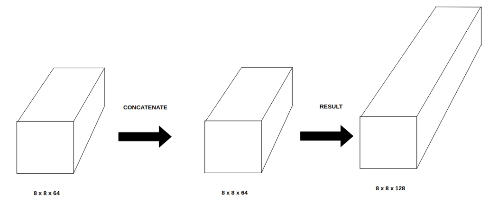

+ Encoder: (CNN)
    - giam chieu rong & dai image by using conv & pooling

+ Decoder: (FCN)
    - phuc hoi kich thuoc anh ban dau 
    - FCN 8, 16, 32

+ What is the difference between upsampling and bi-linear upsampling in a CNN?

    - Upsampling: increasing the size of an image

    - Upsampling techniques:

        - Nearest-Neighbor: copies the value from nearest pixel's value

        - Bilinear: Uses all nearby pixels to calculate the pixel's value. Using **linear interpolations**

        - Bicubic: Same *Bilinear* but using **polynomial interpolations**

    - Details:

        - https://datascience.stackexchange.com/questions/38118/what-is-the-difference-between-upsampling-and-bi-linear-upsampling-in-a-cnn

+ Classmethod & Staticmethod in Python

    - *@classmethod*


+ **Calculated network size**:

    - Convolution + MaxPooling:

        - Output size: **output_width x output_height x numb_filters**
        
        ```
        output_width = (W - F_w + 2*P)/S_w + 1

        - W: width 
        - F_w & F_h: kernel shape
        - P: padding
        - S: stride
        - f: Number of filters
        ```

    - Upsampling:

        - Nearest-Neighbor:
            ```
            output_size = input_size + 2
            ```

        - Bilinear with *scale_factor = a*:
            ```
            output_size = input_size*2
            ```
        
    - Concatenation:

        - it's made by **third** axis (depth)

        - input_w (=output_w) x input_h (=output_h) x input_depth (=**2*output_depth**)


